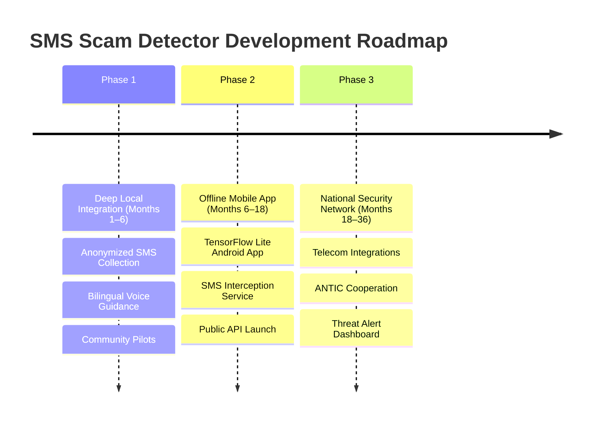

# 🛡️ SMS Scam Detector: Hackathon Pitch Guide & 3-Year Roadmap

This guide is designed to help the team deliver a winning presentation at the **CGIS 2026 Yaoundé Girls in STEAM Hackathon**. It outlines the core value proposition, a 60-second live demo script, answers to expected judge questions, and a 3-year strategic roadmap.

---

## 🎙️ Pitch Strategy & Core Hooks

### The English Hook (for Anglophone Judges)
> "Every day, thousands of Cameroonians receive an SMS saying their Mobile Money account is blocked, or that they have won a prize. It takes just one second of panic to click a link, enter a PIN, and lose a family's savings. We built the **SMS Scam Detector** to act as a digital shield—not only detecting scams instantly but explaining the warning signs in plain language so users learn to protect themselves."

### The French Hook (for Francophone Judges)
> « Chaque jour, des milliers de Camerounais reçoivent un SMS prétendant que leur compte Mobile Money est bloqué. Dans un moment de panique, ils cliquent, partagent leur code PIN, et perdent leurs économies. Notre **SMS Scam Detector** est un bouclier numérique : il détecte les fraudes immédiatement et explique les indices suspects pour éduquer nos proches et nos familles. »

---

## ⚡ The 60-Second Live Demo Workflow

To make the maximum impact during your presentation, run the live demo strictly according to this timeline:

| Time | Action on Dashboard | Speech / Explanation | Key Highlight |
| :--- | :--- | :--- | :--- |
| **00:00 - 00:15** | Click **"Safe family message"** sample in the sidebar. | "We start with a normal message. The app instantly analyzes it, classifies it as **Safe**, and explains why it's clear." | **Green visual indicator**, 99%+ confidence. |
| **00:15 - 00:35** | Click **"Orange Money scam"** or **"MTN MoMo PIN scam"** in the sidebar. | "Now, look at what happens when we paste a local Mobile Money scam. The dashboard instantly turns **Red**, flagging it as **Smishing**." | **Red alert box**, high-risk bar. |
| **00:35 - 00:50** | Scroll down to the **"Why this was flagged"** section. | "We don't just give a score. We show the user *why*: it contains a suspicious link, requests a PIN, and uses urgent language." | **Explainable AI (XAI)** cards and metrics. |
| **00:50 - 01:00** | Click **"Pitch mode: safe vs scam"** toggle. | "For simple daily use, we can toggle our 'Pitch Mode' which maps warnings into a simple binary 'Safe vs Scam' message." | **UX simplicity & user focus**. |

---

## 🙋 Judge Q&A Preparation

Be ready for these common questions from technical and business-oriented judges:

### 1. "How does the model work, and is it too heavy to run locally?"
* **Answer:** "We use a **lightweight Logistic Regression model combined with a TF-IDF vectorizer** and custom structural feature engineering (looking for links, PIN requests, punctuation, and specific keyword frequencies). This model has a tiny footprint, making it incredibly fast. It loads in milliseconds and runs fully offline on a standard laptop, which is essential for deployments in areas with poor internet connection."

### 2. "Where did your training data come from?"
* **Answer:** "Our prototype is trained on a public SMS classification dataset (Mendeley/UCI) combined with synthetic, locally crafted Cameroon-specific scams (mentioning Orange Money, MTN MoMo, and local French/English phrasing). The model was retrained on **6,001 messages**, achieving **95.54% accuracy** and a macro F1-score of **86.94%**."

### 3. "How do you handle user privacy and data security?"
* **Answer:** "Privacy is a core design principle. When a user checks a message, it is processed locally or sent to a secure backend where it is stripped of personal identifiers (like names or specific phone numbers). No real transaction PINs or personal data are ever logged or used for retraining without explicit, anonymized consent."

### 4. "How do you handle bilingual messages (French/English)?"
* **Answer:** "Our preprocessing pipeline is language-agnostic. It normalizes text, removes punctuation, and extracts structural indicators (like URLs and digit sequences) which are identical in both languages. Furthermore, our keyword lists cover both English (e.g., 'blocked', 'won', 'PIN') and French (e.g., 'suspendu', 'gagné', 'code secret') to ensure high recall for Cameroonian smishing styles."

---

## 🗺️ 3-Year Strategic Roadmap

### 📍 Phase 1: Deep Local Integration (Months 1–6)
* **Objective:** Adapt the detection engine to the exact realities of Cameroon's digital ecosystem.
* **Key Tasks:**
  * **Anonymized Local Dataset:** Partner with community groups (like university clubs and CGIS networks) to collect and label 1,000+ real-world French and English scam SMS received in Cameroon.
  * **Bilingual Voice Guidance:** Implement a text-to-speech feature that reads safety tips and explanations out loud in English, French, and local dialects (Pidgin, Camfranglais) to assist users with lower literacy rates.
  * **School & Campus Pilot:** Deploy the web dashboard as an educational tool in school computer labs to train students in cybersecurity awareness.

### 📍 Phase 2: Decentralized & Offline Mobile App (Months 6–18)
* **Objective:** Put the tool directly into the hands of mobile users where scams occur.
* **Key Tasks:**
  * **Android Application:** Port the trained model to **ONNX / TensorFlow Lite** to run natively inside an Android app, requiring zero internet bandwidth.
  * **SMS Interception/Scanning:** Add an optional system permission to scan incoming SMS in real-time, warning the user with a push notification before they open high-risk messages.
  * **Public API:** Provide a developer endpoint for local e-commerce and banking apps to verify if communication links or user-submitted details are suspicious.

### 📍 Phase 3: Nationwide Mobile Security Network (Months 18–36)
* **Objective:** Establish the tool as a core piece of national cybersecurity infrastructure.
* **Key Tasks:**
  * **Telecom Partnerships:** Collaborate with **MTN Cameroon** and **Orange Cameroon** to feed anonymized scam patterns directly into their network-level spam filters.
  * **ANTIC Cooperation:** Coordinate with the **National Agency for Information and Communication Technologies (ANTIC)** to report active phishing domains automatically for rapid shutdown.
  * **Crowdsourced Threat Intel:** Build a "Report Scam" button into the mobile app, creating a real-time heatmap of active SMS fraud campaigns across Cameroon.
